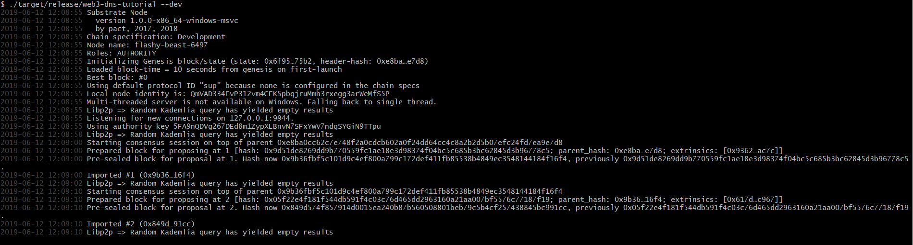

# 2. Setup

First, you need to install Rust and additional dependencies, which might take a while (~20 minutes). If you’re on a Mac or Linux machine, you can do this with the following one-line command:

```bash
curl https://getsubstrate.io -sSf | bash -s -- --fast
```

If you are on windows you probably want to install a Bash shell as well as take a look at the following [instructions](https://github.com/paritytech/substrate#612-windows).  
If everything is ready, you might want to restart your terminal. Once this is done, you can create your own node template folder by running:

```bash
substrate-node-new <project_name> <your_name>
```

Now, make sure you switch to this folder. If you want to run your blockchain, you always need to compile your Wasm image first and then you build the executable. Additionally, you probably want to clean the cache of your previous run.

```bash
./scripts/build.sh               
cargo build --release    
./target/release/<project_name> purge-chain –dev
```

All that is left to do is to finally start your own blockchain:

```bash
./target/release/<project_name>  --dev
```

After this you might need to agree to the firewall settings and you should see something similiar to the following image:



---
**-> [Next: 3. Interface](./3_interface.md)**
