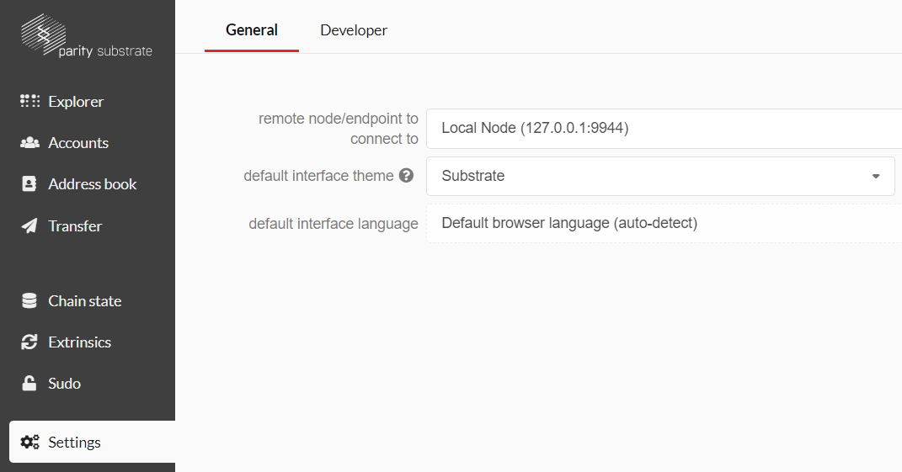
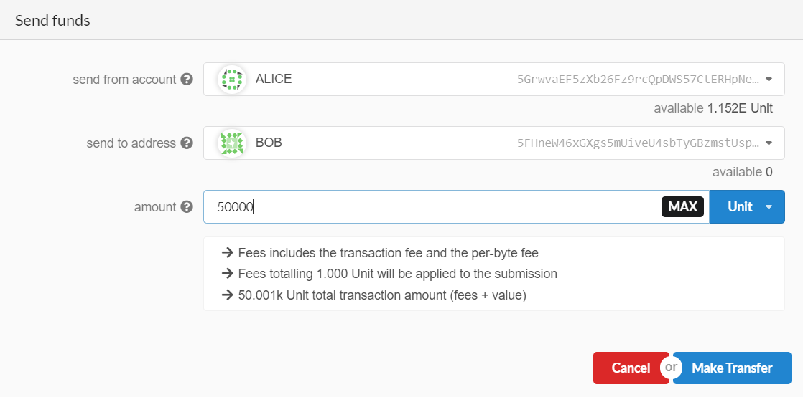
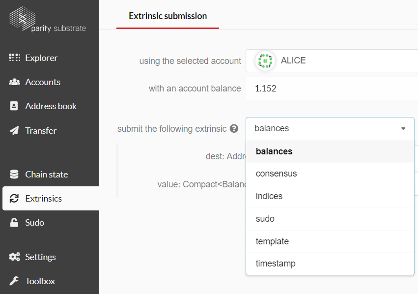

# 3. Interface

Parity provides a nice graphical interface to interact with your blockchain, which doesn’t require you to code your own interface immediately.  It’s the [Polkadot JS UI for Substrate]( https://polkadot.js.org/apps/), which only works in [Chrome](https://www.google.com/chrome/) or some Chromium-based browser. 

With you blockchain running in the console, you can open the website. Make sure to select the settings tab. On this tap chose Local Node (127.0.0.1:9944) as well as Substrate as your interface, as shown in the image below.

Once you have done this, you can click on Save and Reload and start exploring your blockchain. The explorer tab shows the recent blocks produced, and the accounts are listed in the accounts tab. If you want to make your first transfer, you can select the transfer tab. Make sure to select Alice as the sender and somebody else as the receiver. Alice is a pre-funded account. The amount you transfer needs to be higher than the existential deposit. The existential deposit is a minimum an account needs to hold to be part of the system. Additionally, a fixed fee is added to the transaction. Keep in mind that these are only the default settings; you can change this very easily in the [src/chain_spec.rs file](../node/src/chain_spec.rs). If all is correct it should look similar to the following, and you can click on “Make Transfer”: 

The most important tabs for the development process are the chain state and extrinsics tabs. In both, you can select the predefined as well as your own runtime modules. The chain state tab lets you access the storage, and the extrinsics tab provides you access to the public methods of the modules. 

Feel free to explore the different modules. 

---
**-> [Next: 4. Runtime](./4_runtime.md)**