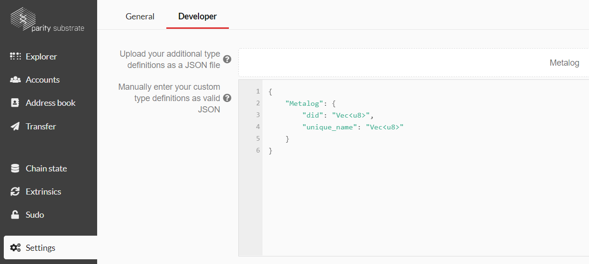
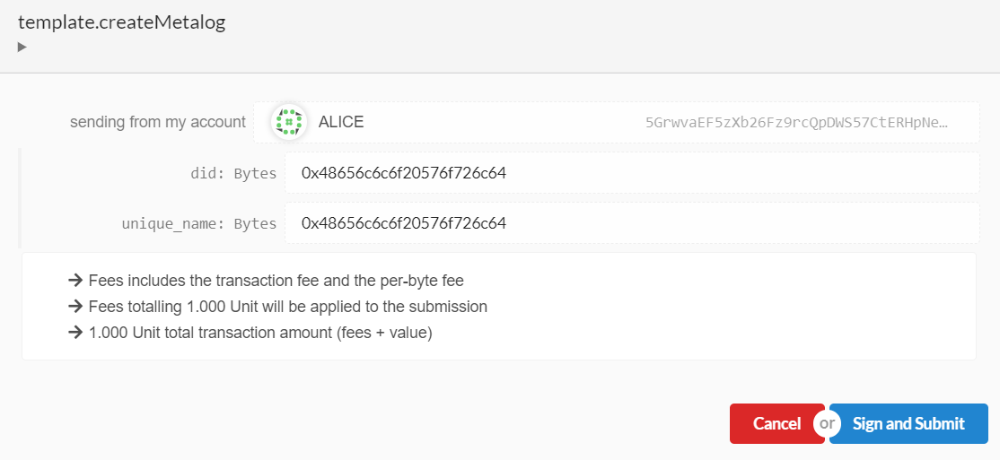
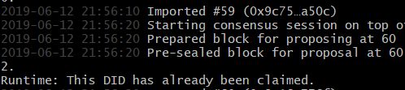
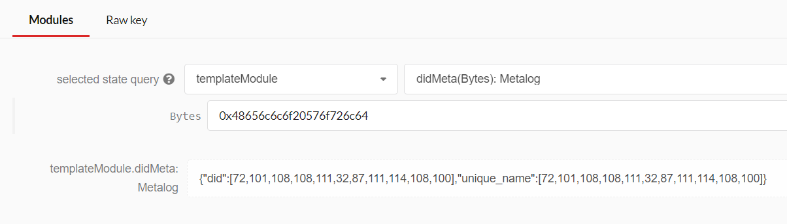

# 5. Testing

Now let’s compile the runtime and run it. As a reminder, here are the commands to do this: 

```bash
./scripts/build.sh               
cargo build --release    
./target/release/<project_name> purge-chain –dev
./target/release/<project_name>  --dev
```

Once the blockchain is running open the [Polkadot JS UI for Substrate](https://polkadot.js.org/apps/) in your Chromium-based browser again. The first thing you need to do is to register the following custom struct with a JSON file or by copy pasting it: 

```
{
    "Metalog": {
        "did": "Vec<u8>",
        "unique_name": "Vec<u8>"
    }
}
```
You can do this by clicking on the settings tab and then selecting the horizontal developer tab (see image below). 



Next, let's head to the extrinsic tab. Select the name of your runtime module and then select the createMetalog method. Make sure you also have selected an account which can pay the transaction fee, which usually should be Alice. Next post the following text in both fields:

```
0x48656c6c6f20576f726c64
```
This stands for “Hello World” and is based on "Simple Concatenated Aggregate Little-Endian" (SCALE) encoding. This stands for “Hello World” and is based on ["Simple Concatenated Aggregate Little-Endian" (SCALE)](https://substrate.dev/docs/en/overview/low-level-data-format) encoding. You now should be able to “Sign and Submit” the transaction and on the right side of your screen, you should see the events popping up. 



If you try to send the exact same transaction again, you should see a red event popping up, and in the terminal, you should see the following error message. 



Next, you can open the chain state tab and query the different storage parts. You open the storage by pressing the blue plus button on the right side. The image below shows an example query of the DID. 



**-> [Next: 6. Writing Tests](./6_tests.md)**