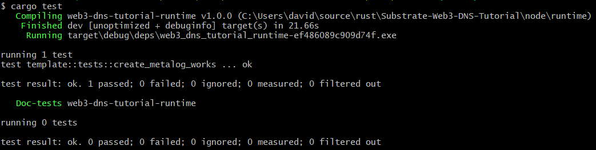

# 6. Writing Tests

In this section, we will start writing unit tests for our runtime. Luckily the template file also contains a basic test setup at the bottom of [template.rs file]( ../node/runtime/src/template.rs). At the beginning inside mod tests are a lot of imports, which help us to create a mock runtime. Here we are going to add the “,assert_noop” import after assert_ok. 
The actual testing function is at the very end and should look like this:
```
#[test]
fn it_works_for_default_value() {
    with_externalities(&mut new_test_ext(), || {
        assert_ok!(TemplateModule::do_something(Origin::signed(1), 42));
        assert_eq!(TemplateModule::something(), Some(42));
    });
}
```
The first thing you probably want to do is to rename this function to something like "create_metalog_works()". When writing tests, you can, in general, follow the NOE-Rule (assert_noop + assert_ok + assert_eq). This means you first write the assert_noop tests inside the test function. With these macros, you essentially test all the ensure cases, which cause your function to fail. Next, you can use assert_ok to test a correct execution of your function, and finally, you test if the result is stored correctly with assert_eq. A testing function could for example look like this:  
```
#[test]
fn create_metalog_works() {
    with_externalities(&mut new_test_ext(), || {
        let did = vec![1, 2];
        let un = vec![1];
        let mut did_too_long = did.clone();
        let mut un_too_long = un.clone();
        for _i in 1..100 {
            did_too_long.push(2);
            un_too_long.push(1);
        }
        assert_noop!(
            TemplateModule::create_metalog(
                Origin::signed(20),
                did_too_long.clone(),
                un.clone()
            ),
            ERR_BYTEARRAY_LIMIT_DID
        );
        assert_noop!(
            TemplateModule::create_metalog(
                Origin::signed(20),
                did.clone(),
                un_too_long.clone()
            ),
            ERR_BYTEARRAY_LIMIT_NAME
        );
        assert_ok!(TemplateModule::create_metalog(
            Origin::signed(20),
            did.clone(),
            un.clone()
        ));
        assert_eq!(TemplateModule::owner_of_did(did), Some(20));
    });
}
```
For the tests to past you also want to comment the following at the very end of the lib.rs file:
```
// impl consensus_authorities::AuthoritiesApi<Block> for Runtime {
//     fn authorities() -> Vec<AuthorityId> {
//         Consensus::authorities()
//     }
// }
```
To run the tests, you need to first switch to the runtime folder inside your terminal and then run the following command:
```
cargo test
```
If everything works correctly you should see something similar to the following on your screen:



---
\
**-> [Next: 7. UI](./7_ui.md)**