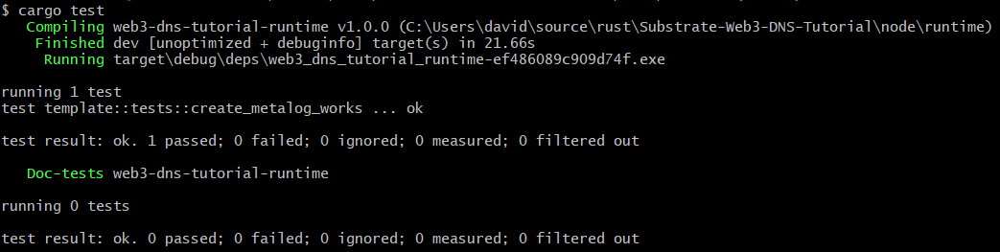

# 6. Unit Tests

In this section, we will start writing a very simple unit tests for our runtime. Keep in mind that if you ever want to release a runtime as part of an active blockchain, you want to do a lot more than just unit tests (e.g., integration, system tests, security audit, etc.). 
Luckily the template file also contains a basic test setup at the bottom of [template.rs file]( ../node/runtime/src/template.rs). At the beginning, inside mod tests, there are some imports which will help us to create a mock runtime. Here, we are going to add the “assert_noop” import after assert_ok. 
The actual testing function is at the very end and should look like this:
```
#[test]
fn it_works_for_default_value() {
    with_externalities(&mut new_test_ext(), || {
        assert_ok!(TemplateModule::do_something(Origin::signed(1), 42));
        assert_eq!(TemplateModule::something(), Some(42));
    });
}
```
The first thing you'll probably want to do is to rename this function to something like "create_metalog_works()". 

When writing runtime tests, it makes sense to follow the [equivalence class partitioning technique]( https://en.wikipedia.org/wiki/Equivalence_partitioning) to derive test cases, and you want to write at least one test for each equivalence class. Ideally, you test the interior as well as the boundary values of each equivalence class. To determine the different equivalence classes in this example, you can take a look at different the ensure statements. 

If you are unfamiliar with equivalence class testing, you can also just follow the NOE-Rule (assert_noop + assert_ok + assert_eq). This means that you first write the assert_noop tests inside the test function. With these macros, you essentially test all the ensure cases, which cause your function to fail. Next, you can use assert_ok to test a correct execution of your function, and finally, you can test if the result is stored correctly with assert_eq. A testing function could for example look like this:  
```
#[test]
fn create_metalog_works() {
    with_externalities(&mut new_test_ext(), || {
        let did = vec![1, 2];
        let un = vec![1];
        let mut did_too_long = did.clone();
        let mut un_too_long = un.clone();
        for _i in 1..100 {
            did_too_long.push(2);
            un_too_long.push(1);
        }
        assert_noop!(
            TemplateModule::create_metalog(
                Origin::signed(20),
                did_too_long.clone(),
                un.clone()
            ),
            ERR_BYTEARRAY_LIMIT_DID
        );
        assert_noop!(
            TemplateModule::create_metalog(
                Origin::signed(20),
                did.clone(),
                un_too_long.clone()
            ),
            ERR_BYTEARRAY_LIMIT_NAME
        );
        assert_ok!(TemplateModule::create_metalog(
            Origin::signed(20),
            did.clone(),
            un.clone()
        ));
        assert_eq!(TemplateModule::owner_of_did(did), Some(20));
    });
}
```
Keep in mind that the above function is just an example and neither tests all equivalence classes nor the interior as well as boundary values. Feel free to write additional tests as an exercise. 

For the tests to past you'll also want to comment the following at the very end of the lib.rs file:
```
// impl consensus_authorities::AuthoritiesApi<Block> for Runtime {
//     fn authorities() -> Vec<AuthorityId> {
//         Consensus::authorities()
//     }
// }
```
To run the tests, you'll need to first switch to the runtime folder inside your terminal and then run the following command:
```
cargo test
```
If everything works correctly you should see something similar to the following on your screen:



**-> [Next: 7. UI](./7_ui.md)**
