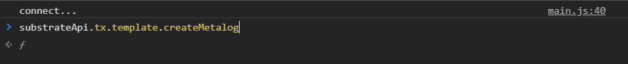
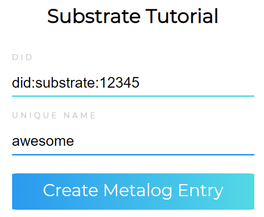

# 7. UI

For the UI, we will use npm and [webpack](https://webpack.js.org/). To get started, create a project folder and run the following commands inside this folder in your terminal. 

```
npm init -y
npm install webpack --save-dev
npm install webpack-cli --save-dev
```
Next, create an [index.html](../ui/dist/index.html) file, a [style.css](../ui/css/style.css) file inside a [css](../ui/css/style.css) folder as well as an [index.js file](../ui/src/index.js) inside an src folder. Additionally, you'll want to create a webpack.config.js, which basically tells webpack what to do. For this tutorial we will focus on the [index.js file](../ui/src/index.js) file, so feel free to copy the content of the [html](../ui/dist/index.html), [css](../ui/css/style.css) and [webpack.config.js](../ui/webpack.config.js) file from the UI folder of this GitHub repro. 

You will also need to change the scripts' part of the package.json file to the following: 
```
"scripts": {
    "test": "echo \"Error: no test specified\" && exit 1",
    "build": "webpack"
},
```

Now, we'll install the packages to interact with our substrate runtime:
```
npm i @polkadot/api@0.82.0-beta.9
npm i @polkadot/keyring@0.94.0-beta.3
```
and import these packages at the top of our js file as well as define two constants. The constant represents the WebSocket endpoint. 
```
import { ApiPromise, WsProvider } from '@polkadot/api';
import { Keyring } from '@polkadot/keyring';

const provider = new WsProvider('ws://127.0.0.1:9944');
```
Next, we'll define a small substrate function: 
```
async function substrate() {
    console.log('connect...');
    const api = await ApiPromise.create({
        provider: provider,
        types: {
            // Register custom type
            Metalog: {
                did: "Vec<u8>",
                unique_name: "Vec<u8>"
            },
        },
    });
    
    // For console testing 
    window.substrateApi = api;
}

window.onload = substrate();
```
This function automatically connects to our runtime, registers our custom type, as well as makes the API calls available inside the console of your browser. To test this, you can now start your blockchain runtime and use webpack to generate the main.js file with:
```
npm run build
```
Next, you can open the index.html file in your browser and open the developer console. At the top, you should see “connect…” and, if you type for example "substrateApi.tx.", you should now be able to select the different modules of your runtime (see the image below). 



Now, we'll integrate a function to create a Metalog entry on our blockchain and we'll add an event listener to the button element: 
```
document.getElementById("button").addEventListener("click", async function () {
    let did = document.getElementById("did").value;
    let unique_name = document.getElementById("name").value;

    const keyring = new Keyring({ type: 'sr25519' });
    const alice = keyring.addFromUri('//Alice');

    const transfer = await api.tx.template.createMetalog(did, unique_name);
    const hash = await transfer.signAndSend(alice);
    console.log('Transfer sent with hash', hash);
});
```
At the beginning of the function, we'll read the content of the two input fields. Next, we'll generate the keys of our Alice user. Of course, usually, you wouldn’t hard-code the user into your application. This is just for testing. Finally, we'll create the transaction, sign it, and send it. 



You can easily test if everything works by sending the same transaction twice. In this case you should see an error message inside your runtime terminal.

**-> [Next: 8. Next Steps](./8_next_steps.md)**
